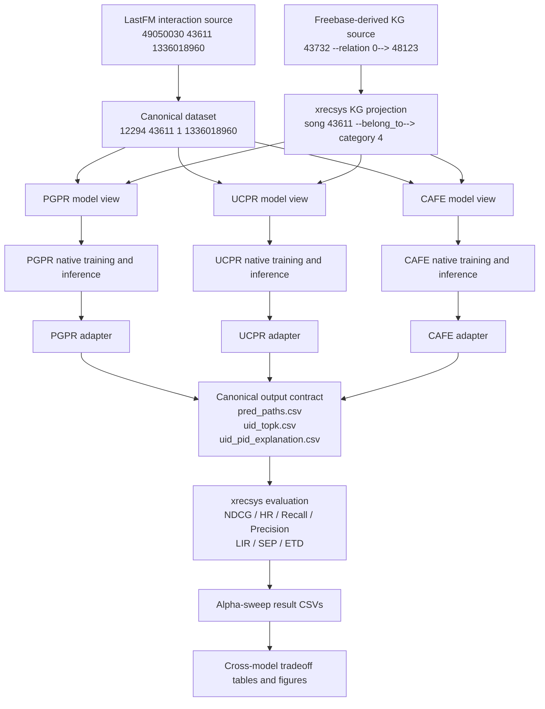
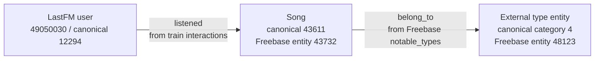
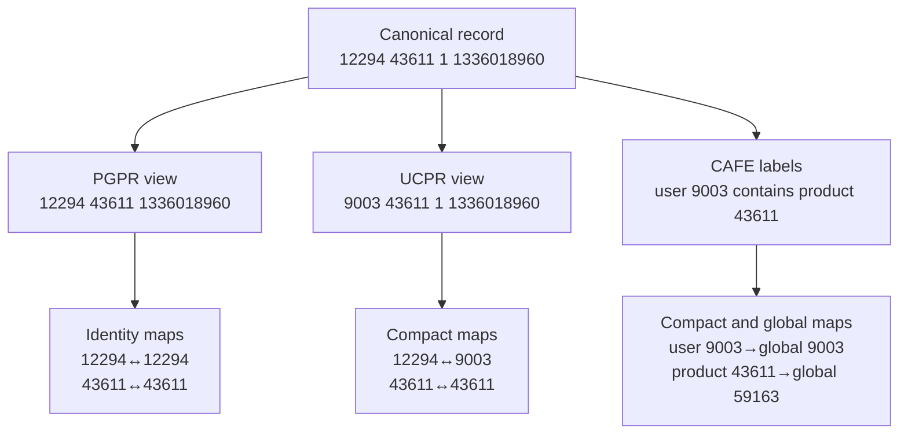
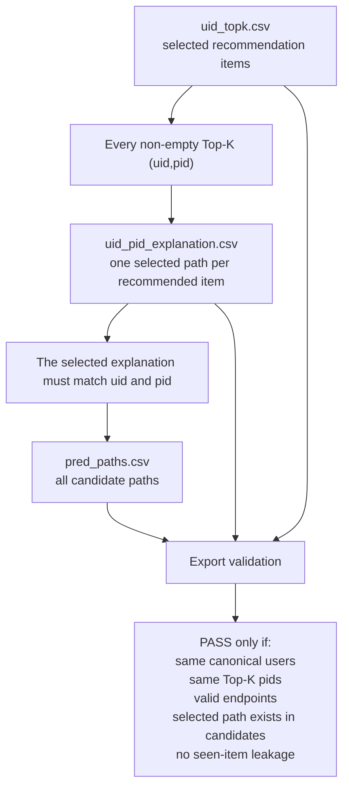
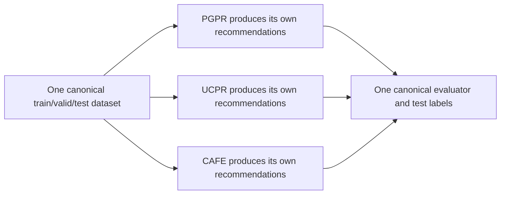
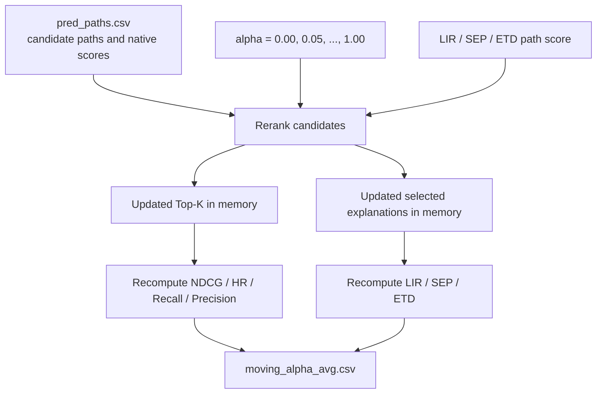
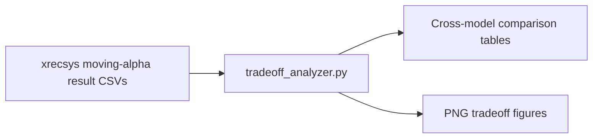

# LastFM Cross-Model Data Flow: A Concrete PGPR, UCPR, and CAFE Example

Date: 2026-06-23

## 1. Purpose

This document explains how one real LastFM interaction is transformed and
used by PGPR, UCPR, and CAFE.

The explanation follows the same user and song through:

1. the LastFM interaction source;
2. the Freebase-derived knowledge graph;
3. the canonical dataset;
4. the three model-specific views;
5. native model training and path inference;
6. model-specific output adapters;
7. canonical evaluation in `xrecsys`;
8. the final accuracy-explainability tradeoff figures.

The central example is:

```text
source user id:       49050030
canonical user id:    12294
canonical song id:    43611
timestamp:            1336018960
song name:            Somewhere On Fullerton
LastFM track id:       243038
KG-completion id:      43732
Freebase MID:          m.0pqvpk
```

A key distinction used throughout this document is:

```text
Canonical dataset:
    defines the shared experimental identity, split, labels, and evaluation
    population.

Model view:
    converts the canonical experiment into a model-readable representation.

Adapter:
    converts native model outputs back into the canonical evaluation
    representation.
```

## 2. End-to-End Overview



The models are allowed to produce different recommendations and paths. What
must remain shared is the experimental question:

```text
the same train/validation/test interactions,
the same test labels,
the same test-user population,
and the same canonical user and product identities.
```

## 3. Source Data

The experiment combines several source layers. They should not be treated as
one original dataset.

### 3.1 LastFM interaction source

The source interaction file contains rows such as:

```text
49050030 43611 1336018960
```

The columns used here are:

```text
source_user_id  xrecsys_song_id  timestamp
```

The row means that source user `49050030` listened to the song represented by
xrecsys song id `43611` at timestamp `1336018960`.

The same interaction occurs more than once at different timestamps:

```text
49050030 43611 1336018960
49050030 43611 1336097860
49050030 43611 1392788946
```

These are interaction records. They do not contain artist, category, producer,
or other knowledge-graph relations.

### 3.2 User mapping source

The xrecsys user mapping contains:

```text
kgid    lastfmid
12294   49050030
```

Therefore:

```text
LastFM source user 49050030
        ↕
xrecsys user kgid 12294
```

For this project, xrecsys user kgid `12294` is selected as the canonical user
id.

### 3.3 Product mapping source

The xrecsys product mapping contains:

```text
kgid   lastfmid   kgcompletionid   trackname                freebaseid
43611  243038     43732            Somewhere On Fullerton   m.0pqvpk
```

This connects four representations of the same song:

```text
canonical/xrecsys song id:  43611
LastFM track id:             243038
KG-completion entity id:     43732
Freebase MID:                m.0pqvpk
```

The canonical product id is therefore not the Freebase entity id:

```text
canonical pid 43611 != KG-completion id 43732
```

The mapping table is what makes the two spaces traceable.

### 3.4 Freebase-derived KG source

Freebase is an external general-purpose knowledge graph. It was not created
by LastFM or by this project.

The xrecsys LastFM release includes a processed, integer-encoded Freebase
subgraph under:

```text
xrecsys/datasets/lastfm/kg-completion/
```

The relevant KG triple is:

```text
43732 0 48123
```

Its format is:

```text
head_entity_id  relation_id  tail_entity_id
```

Relation id `0` maps to:

```text
http://rdf.freebase.com/ns/common.topic.notable_types
```

The category mapping contains:

```text
kg_id  kg_completion_id  freebase_id
4      48123             m.0kpv11
```

After entity remapping, the triple becomes:

```text
song 43611 --relation 0--> category 4
```

The historical xrecsys preprocessing assigns the model-facing name
`belong_to` to relation `0`:

```text
common.topic.notable_types
        ↓ historical schema projection
belong_to
```

The resulting edge is:

```text
song 43611 --belong_to--> category 4
```

This is a semantic projection inherited from xrecsys. The structural mapping
is traceable to the original Freebase triple, but the name `category` should
not be interpreted as proof that the Freebase object is strictly a musical
genre. Its original predicate is `notable_types`.

### 3.5 Interaction graph and knowledge graph are different sources

The complete graph used by a path model combines two kinds of edges:



The `listened` edge is produced from training interactions. The `belong_to`
edge is produced from the external KG projection. Validation and test
interactions must not be inserted into the training interaction graph.

## 4. Canonical Processing

### 4.1 Where canonical ids come from

The project defines the role called `canonical id`, but it does not invent a
new random number for this LastFM example.

The selected policy is:

```text
canonical_uid = xrecsys user kgid
canonical_pid = xrecsys song kgid
```

Therefore:

```text
source user 49050030 → canonical user 12294
xrecsys song 43611   → canonical song 43611
```

The human decision is which existing id space becomes the shared experiment
coordinate system. The numerical values are inherited from the existing
xrecsys mappings.

### 4.2 Canonical interaction conversion

The source row:

```text
49050030 43611 1336018960
```

becomes:

```text
12294    43611    1       1336018960
uid      pid      rating  timestamp
```

The transformations are:

| Field | Source | Canonical | Reason |
| --- | ---: | ---: | --- |
| user | `49050030` | `12294` | Map source user to xrecsys user kgid |
| product | `43611` | `43611` | Product is already in the selected xrecsys song-id space |
| rating | absent | `1` | Represent implicit positive feedback |
| timestamp | `1336018960` | `1336018960` | Preserve the source timestamp |

### 4.3 Canonical split and label outputs

The canonical layer writes:

```text
interactions/train.tsv.gz
interactions/valid.tsv.gz
interactions/test.tsv.gz

labels/train_label.pkl
labels/valid_label.pkl
labels/test_label.pkl

mappings/user_mapping.tsv
mappings/product_mapping.tsv
metadata.json
```

The label format is:

```python
{
    canonical_uid: [canonical_pid_1, canonical_pid_2, ...]
}
```

For example, the canonical training labels for user `12294` include song
`43611`.

### 4.4 What the canonical layer standardizes

It standardizes:

1. user identity;
2. product identity;
3. train/validation/test membership;
4. test labels;
5. the canonical test-user population;
6. source KG provenance;
7. the id space required at evaluation time.

It does not require all models to use the same internal numeric ids or the
same internal graph representation.

## 5. Model-View Construction Before Training

Model views are generated before native model preprocessing and training.
They make the canonical data readable by each model.



### 5.1 PGPR view

PGPR uses identity mappings for this canonical LastFM view:

```text
canonical uid 12294 → PGPR user id 12294
canonical pid 43611 → PGPR song id 43611
```

The PGPR interaction row is:

```text
12294 43611 1336018960
```

The implicit rating column is removed because the LastFM PGPR loader expects:

```text
uid pid timestamp
```

The KG schema remains:

```text
user 12294 --listened--> song 43611
song 43611 --belong_to--> category 4
```

PGPR constructs bidirectional adjacency for the knowledge edge, allowing:

```text
song 43611 → category 4
category 4 → song 43611
```

The same semantic relation name is used in both traversal directions.

### 5.2 UCPR view

UCPR requires compact model-local user ids. Its remap table contains:

```text
canonical_uid  ucpr_uid
12294          9003
```

For this song, the compact product index happens to equal the canonical pid:

```text
canonical_pid  ucpr_product_idx
43611          43611
```

This equality is incidental and must not be assumed for every dataset or
future view.

The UCPR interaction row is:

```text
9003 43611 1 1336018960
```

UCPR also uses model-local schema names:

```text
song       → product
category   → genre
belong_to  → belong_to_genre
```

The KG fragment therefore becomes:

```text
user 9003 --listened--> product 43611
product 43611 --belong_to_genre--> genre 4
```

### 5.3 CAFE view

CAFE reuses the compact UCPR user and product order:

```text
canonical uid 12294 → CAFE uid 9003
canonical pid 43611 → CAFE product 43611
```

CAFE stores a user's training products on one label row. The real row for
user `9003` begins:

```text
9003 21104 43611 43612 43611 43612 21104 47367 20495 ...
```

Thus product `43611` is part of this user's CAFE training history.

CAFE then creates one global entity space across entity types:

```text
global 9003
    local id: user_9003
    value: canonical_uid_12294

global 59163
    local id: product_43611
    value: canonical_pid_43611

global 68584
    local id: genre_4
```

Its relation table includes:

```text
0  listened
1  belong_to_genre
5  rev_listened
6  rev_belong_to_genre
```

The actual triples include:

```text
9003  0 59163
59163 5 9003

59163 1 68584
68584 6 59163
```

Their semantic form is:

```text
user 9003 --listened--> product 43611
product 43611 --rev_listened--> user 9003

product 43611 --belong_to_genre--> genre 4
genre 4 --rev_belong_to_genre--> product 43611
```

Unlike PGPR, CAFE explicitly assigns separate relation ids and `rev_` names
to reverse edges.

## 6. How Correspondence Is Preserved During Training

The canonical ids do not need to appear directly inside every model. What must
be preserved is an auditable round trip:

```text
canonical identity
→ model-local identity
→ native model processing
→ model-local output
→ canonical identity
```

### 6.1 Mapping tables are created before training

The model views write mappings such as:

```text
canonical_uid ↔ model_uid
canonical_pid ↔ model_product_id
```

PGPR uses identity mappings. UCPR and CAFE use compact mappings.

### 6.2 Split round-trip validation

After a model view is built, its interactions or labels are mapped back to
canonical ids:

```text
model train data
→ inverse user/product maps
→ reconstructed canonical train labels
```

The reconstructed labels must exactly equal:

```text
canonical labels/train_label.pkl
```

The same validation is performed for validation and test labels where
applicable.

### 6.3 Model-local KG projection is recorded separately

Interaction correspondence does not imply that every model sees an identical
internal KG.

For LastFM:

| Model | Product/type naming | Relation handling |
| --- | --- | --- |
| PGPR | `song`, `category` | Keeps the PGPR-supported xrecsys relation files |
| UCPR | `product`, `genre` | Renames and keeps a selected relation subset |
| CAFE | `product`, `genre` | Reuses UCPR projection and adds explicit reverse edges |

The interaction split is shared. The model-specific KG projection must be
reported because it may affect model behavior.

## 7. Native Model Training and Inference

### 7.1 PGPR

PGPR performs:

```text
PGPR preprocessing
→ TransE embedding training
→ reinforcement-learning policy training
→ beam-search path inference
```

For canonical user `12294`, the real PGPR Top-10 begins:

```text
759 6711 760 2845 3971 444 323 286 885 2536
```

Its first recommendation has the native path:

```text
self_loop user 12294
listened song 43611
belong_to category 4
belong_to song 759
```

This path directly uses the concrete source interaction followed in this
document.

### 7.2 UCPR

UCPR performs:

```text
UCPR preprocessing
→ TransE embedding training
→ UCPR policy training
→ beam-search path inference
```

For model-local user `9003`, its output is mapped back to canonical user
`12294`. The real canonical Top-10 begins:

```text
6711 29971 6801 2269 323 28295 16181 13011 16222 759
```

Its first explanation is a collaborative path:

```text
self_loop user 12294
listened song 14726
listened user 2491
listened song 6711
```

UCPR did not select song `43611` for this particular explanation. That is
expected: the model reasons over the user's complete training history and the
full projected graph, not over one isolated input row.

### 7.3 CAFE

CAFE performs:

```text
CAFE KG/program preprocessing
→ neural-symbolic module training
→ native program/path execution
```

For model-local user `9003`, the real canonical Top-10 begins:

```text
4048 11987 24938 29971 3972 6801 3971 19206 13011 2536
```

Its first explanation is:

```text
self_loop user 12294
listened song 20495
belong_to category 4
belong_to song 4048
```

CAFE selected another item from the same user's training history as its path
anchor.

### 7.4 Why the three outputs are allowed to differ

The models are being compared precisely because they implement different
recommendation and path-reasoning mechanisms.

The shared dataset does not force:

```text
the same recommendation,
the same explanation,
the same path candidates,
or the same internal score.
```

It forces:

```text
the same experimental input split,
the same held-out answer set,
and the same evaluation population.
```

## 8. Post-Processing Adapters

Adapters operate after native model inference. They do not construct the
original Freebase graph.

Their purpose is:

```text
native model output
→ canonical recommendation and path output
```

### 8.1 PGPR adapter

The PGPR adapter:

1. loads native beam-search paths;
2. keeps paths ending at a valid product type;
3. removes train/validation-seen products;
4. computes the native PGPR TransE item score;
5. uses policy action probabilities for explanation-path selection;
6. writes canonical output CSVs.

The LastFM PGPR view already uses canonical user/product ids and canonical
relation names, so little id or relation renaming is required.

### 8.2 UCPR adapter

The UCPR adapter applies:

```text
UCPR uid 9003       → canonical uid 12294
UCPR product 43611  → canonical song 43611
product             → song
genre               → category
belong_to_genre     → belong_to
```

It also filters seen items and writes the canonical output contract.

### 8.3 CAFE adapter

The CAFE adapter applies:

```text
CAFE uid 9003       → canonical uid 12294
CAFE product id     → canonical song id
product             → song
genre               → category
belong_to_genre     → belong_to
rev_belong_to_genre → belong_to
```

Removing `rev_` during canonical export prevents a traversal direction from
being counted as a separate semantic explanation type.

## 9. Canonical Output Contract

Each native-path model exports:

```text
pred_paths.csv
uid_topk.csv
uid_pid_explanation.csv
```

The three files are not independent.

### 9.1 `pred_paths.csv`

This file contains all exported candidate paths:

```text
uid,pid,path_score,path_prob,path
12294,759,0.717363,0.142627,
self_loop user 12294 listened song 43611
belong_to category 4 belong_to song 759
```

One `(uid, pid)` pair may have multiple candidate paths.

This file is used for:

1. candidate reranking;
2. explanation replacement;
3. LIR-, SEP-, and ETD-aware alpha optimization.

### 9.2 `uid_topk.csv`

This file contains the current final recommendation list:

```text
uid,top10
12294,759 6711 760 2845 3971 444 323 286 885 2536
```

It is compared with canonical `test_label.pkl` to compute:

```text
NDCG
HR
Recall
Precision
```

### 9.3 `uid_pid_explanation.csv`

This file assigns one selected explanation to each recommended item:

```text
uid,pid,path
12294,759,
self_loop user 12294 listened song 43611
belong_to category 4 belong_to song 759
```

It is used to compute:

```text
LIR
SEP
ETD
```

### 9.4 Required alignment between the three files



The required invariants are:

1. every non-empty `(uid, pid)` in `uid_topk.csv` has exactly one row in
   `uid_pid_explanation.csv`;
2. no extra explanation item exists outside the user's Top-K;
3. the explanation path starts at the row's `uid`;
4. the explanation path ends at the row's `pid`;
5. the selected explanation exists in `pred_paths.csv`;
6. every output user belongs to the canonical test-user set;
7. no train/validation-seen item appears in the recommendations;
8. the complete canonical test-user set is retained, including users with an
   empty native-path recommendation list.

## 10. Why Evaluation Must Use One Shared Dataset

Each model should generate its own output data. It should not generate its own
evaluation truth.

If models use separate test sets, a result such as:

```text
PGPR HR@10 = 0.25
UCPR HR@10 = 0.20
```

is not interpretable when:

```text
PGPR evaluates only users for whom it found paths,
UCPR evaluates all test users,
or the two models used different train/test splits.
```

Without a shared canonical dataset, differences may come from:

1. different held-out interactions;
2. different test-user populations;
3. different seen-item definitions;
4. validation/test leakage;
5. filtering difficult users;
6. filtering products differently;
7. different Recall denominators.

The intended comparison is:



The outputs remain model-specific. The evaluation question remains shared.

## 11. xrecsys Evaluation and Figure Generation

### 11.1 Loading the exported data

`xrecsys/path_data_loader.py` loads:

```text
uid_topk.csv
uid_pid_explanation.csv
pred_paths.csv
canonical test labels
interaction timestamps
the evaluation KG
```

The recommendation metrics use:

```text
uid_topk.csv + canonical test_label.pkl
```

The explanation metrics use:

```text
uid_topk.csv + uid_pid_explanation.csv
```

The reranking procedures use:

```text
pred_paths.csv
```

### 11.2 Explanation metrics

At a high level:

```text
LIR:
    rewards explanations anchored in temporally relevant user interactions.

SEP:
    uses the related entity and its degree-derived weight in the evaluation KG.

ETD:
    measures diversity of explanation/path types in the selected Top-K.
```

The three CSVs must use the same canonical ids because these calculations join
recommendations, paths, labels, timestamps, and KG entities by `uid`, `pid`,
entity type, and entity id.

### 11.3 Alpha reranking

For a metric such as LIR, a candidate receives a mixed score:

```text
mixed_score =
    (1 - alpha) × native_path_or_item_score
    + alpha × LIR(path)
```

The process is:



At `alpha = 0`, the ranking is driven by the native recommendation/path
score. As alpha increases, explanation quality receives more weight.

### 11.4 Result tables

`xrecsys/main.py` writes files such as:

```text
baseline_avg.csv
LIRopt_moving_alpha_avg.csv
SEPopt_moving_alpha_avg.csv
ETDopt_moving_alpha_avg.csv
```

Each row records:

```text
alpha, metric, group, data, optimization
```

For example:

```text
0.00,ndcg,Overall,...
0.00,hr,Overall,...
0.00,LIR,Overall,...
0.05,ndcg,Overall,...
0.05,LIR,Overall,...
```

### 11.5 Figure generation

The tradeoff plotting script reads the alpha-sweep result CSVs, pivots the
Overall metrics by alpha, and plots:

```text
x-axis: LIR, SEP, or ETD
y-axis: NDCG, HR, Recall, or Precision
one point: one alpha value
one line: one model
```



`xrecsys` computes and stores the metrics. The analysis script produces the
final plots.

## 12. Tracing Model Outputs Back to the Sources

All model outputs first return to canonical ids.

### 12.1 User trace

```text
PGPR internal user: 12294
UCPR internal user: 9003
CAFE internal user: 9003
        ↓ adapters
canonical user: 12294
        ↓ user mapping
LastFM source user: 49050030
```

### 12.2 PGPR recommendation trace

PGPR recommends canonical song `759`:

```text
canonical pid:  759
LastFM track:   562208
song name:      At the Back of Beyond
Freebase MID:   m.0d_c7mf
```

### 12.3 UCPR recommendation trace

UCPR recommends canonical song `6711`:

```text
canonical pid:  6711
LastFM track:   531833
song name:      Careering
Freebase MID:   m.0193211
```

### 12.4 CAFE recommendation trace

CAFE recommends canonical song `4048`:

```text
canonical pid:  4048
LastFM track:   234993
song name:      The Slumber of Yesteryears
Freebase MID:   m.0p9fpb
```

### 12.5 Relation trace

The model-facing relation can also be traced:

```text
PGPR:
    belong_to

UCPR:
    belong_to_genre

CAFE:
    belong_to_genre / rev_belong_to_genre

        ↓ canonical adapters

canonical:
    belong_to

        ↓ source provenance

Freebase relation id:
    0

Freebase predicate:
    common.topic.notable_types
```

This trace separates:

1. source semantics;
2. historical xrecsys schema projection;
3. model-local relation naming;
4. canonical evaluation naming.

## 13. Validation Boundaries

The current checks can establish:

1. exact interaction split round trips;
2. exact user and product id round trips;
3. valid path user/product endpoints;
4. agreement between Top-K items and selected explanations;
5. presence of selected explanations in candidate paths;
6. no train/validation item leakage;
7. complete canonical test-user accounting;
8. finite normalized scores and probabilities.

These checks do not by themselves prove that every historical relation name is
the best semantic description of its Freebase predicate.

For example:

```text
common.topic.notable_types → belong_to/category
```

is structurally traceable and reproducible, but its semantic naming is an
inherited xrecsys modeling decision. A relation-projection audit should
therefore distinguish:

```text
mapping correctness
from
semantic interpretation.
```

## 14. Summary

The full example can be compressed into the following chain:

```text
LastFM interaction:
49050030 43611 1336018960

        ↓ canonical user mapping

canonical interaction:
12294 43611 1 1336018960

        ↓ model views

PGPR: user 12294, song 43611
UCPR: user 9003, product 43611
CAFE: user 9003, product 43611, global product entity 59163

        ↓ native training and path inference

three different recommendation lists and explanation paths

        ↓ adapters

all outputs restored to canonical uid/pid and relation names

        ↓ shared xrecsys evaluation

accuracy and explanation metrics computed against the same test labels

        ↓ alpha-sweep analysis

cross-model accuracy-explainability tradeoff figures
```

The canonical layer does not make the models identical. It makes their
differences measurable.
