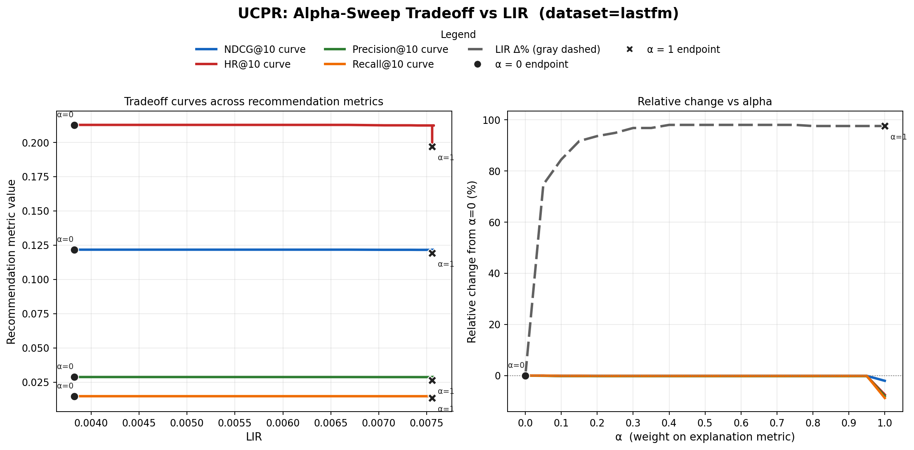
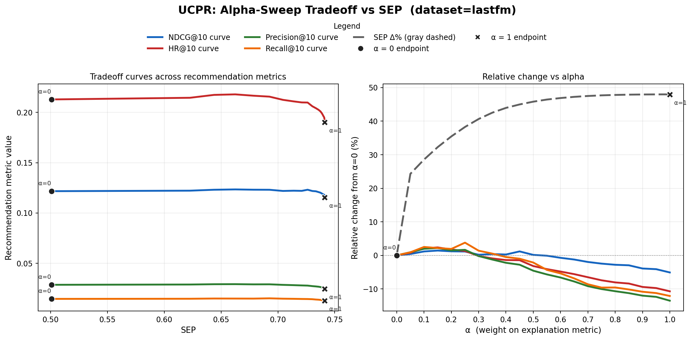
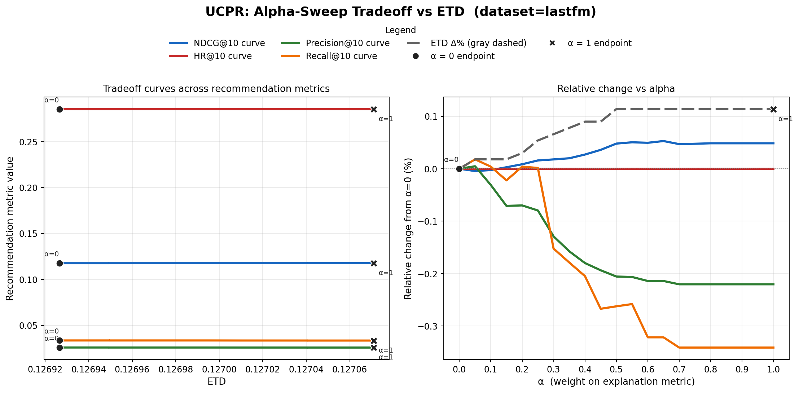

# Native Path Recommendation Evaluation Progress Report

Date: 2026-06-12

This note summarizes the current experiment direction, the canonical dataset architecture, and the concrete PGPR/UCPR results produced in the recent debug run.

## 1. Core Direction

The current direction is to evaluate **native-path KG recommender models** with a shared canonical dataset and a shared xrecsys evaluation layer.

The main principle is:

```text
Only explanations that are generated by the model's native recommendation mechanism
should be scored with path-based explainability metrics.
```

This means:

- `PGPR`, `UCPR`, and future `CAFE` are valid for `LIR / SEP / ETD` because they generate recommendation paths natively.
- Latent GNN models without native recommendation paths should not be evaluated with post-hoc DFS paths as if those paths were model-native explanations.
- Strong non-path models can still be used as accuracy references, but not as native explainability baselines.

## 2. New Architecture

The current pipeline is:

```text
canonical dataset
  -> model-specific view
  -> native model training/test
  -> native path export
  -> adapter to xrecsys CSV schema
  -> xrecsys baseline + alpha-sweep evaluation
  -> tradeoff figures and tables
```

The intended loose coupling is:

```text
model code only needs to export native paths
xrecsys only needs standard CSVs in canonical id space
```

### Important Files

- Canonical standard: `docs/guides/CANONICAL_DATASET_STANDARD.md`
- Experiment architecture: `docs/guides/NATIVE_PATH_EXPERIMENT_ARCHITECTURE_2026-06-11.md`
- PGPR adapter: `adapters/pgpr_adapter.py`
- UCPR adapter: `adapters/ucpr_adapter.py`
- Tradeoff plotting: `scripts/analysis/tradeoff_analyzer.py`

### Standard xrecsys Path Schema

Each model is converted to:

```text
xrecsys/paths/{dataset}/agent_topk={tag}/
  pred_paths.csv
  uid_topk.csv
  uid_pid_explanation.csv
```

The evaluation result goes to:

```text
xrecsys/results/{dataset}/agent_topk={tag}/
```

For the current canonical LastFM run:

```text
PGPR tag: 10-12-1-pgpr-canonical
UCPR tag: 10-12-1-ucpr-canonical
```

Note: the tag is an xrecsys folder label. It is not necessarily the original beam-search top-k used inside each model.

## 3. What Was Done

### Dataset / Mapping Layer

- Built a canonical `lastfm_v1` dataset layer.
- Built model views for PGPR and UCPR.
- Confirmed that outputs should be mapped back to canonical `uid/pid` before xrecsys evaluation.
- Patched adapters to support canonical labels and canonical remap files.

### UCPR

- Confirmed UCPR native test had completed.
- Converted UCPR `pred_paths.pkl` into xrecsys CSVs.
- Ran xrecsys baseline.
- Ran full `LIRopt`, `SEPopt`, and `ETDopt` alpha sweeps.
- Generated UCPR single-model tradeoff figures.

### PGPR

- Converted PGPR `policy_paths_epoch50.pkl` into xrecsys CSVs.
- Ran xrecsys baseline.
- Ran full `LIRopt`.
- Re-ran full `SEPopt` after a previous `Ctrl-C` interruption.
- `ETDopt` is currently running in the background at the time this document was written.

### Reliability / Run Management

- Moved long-running xrecsys jobs into `tmux` sessions to avoid SSH/VSCode terminal interruption.
- Added line-buffered xrecsys logging so long alpha sweeps are observable.
- Added `--only_baseline` to xrecsys so baseline evaluation can be run without accidentally triggering optimization.

## 4. Current Result Locations

### UCPR Completed Results

```text
xrecsys/results/lastfm/agent_topk=10-12-1-ucpr-canonical/
  baseline_avg.csv
  LIRopt_moving_alpha_avg.csv
  SEPopt_moving_alpha_avg.csv
  ETDopt_moving_alpha_avg.csv
```

### PGPR Results

```text
xrecsys/results/lastfm/agent_topk=10-12-1-pgpr-canonical/
  baseline_avg.csv
  LIRopt_moving_alpha_avg.csv
  SEPopt_moving_alpha_avg.csv
  ETDopt_moving_alpha_avg.csv  # still running at write time
```

### Current Figures

UCPR single-model figures are available at:

```text
reports/figures/tradeoff/canonical_lastfm_native_paths/
```

Current generated figures:

- `tradeoff_lastfm_UCPR_LIR.png`
- `tradeoff_lastfm_UCPR_SEP.png`
- `tradeoff_lastfm_UCPR_ETD.png`

PGPR and PGPR-vs-UCPR figures are scheduled to be generated automatically after PGPR `ETDopt` finishes.

## 5. Baseline Results

Overall xrecsys baseline metrics:

| Model | NDCG | HR | Precision | Recall | LIR | SEP | ETD |
|---|---:|---:|---:|---:|---:|---:|---:|
| PGPR | 0.1743 | 0.2975 | 0.0450 | 0.0161 | 0.0082 | 0.6363 | 0.2590 |
| UCPR | 0.1217 | 0.2128 | 0.0287 | 0.0147 | 0.0041 | 0.5008 | 0.1132 |

Interpretation:

- PGPR currently has stronger baseline recommendation quality and stronger baseline explanation metrics.
- UCPR is a successful canonical-path reproduction, but should currently be treated as a first-run/smoke reproduction rather than a final tuned result.

## 6. Candidate Path Pool Comparison

The biggest observed difference is the size and density of the native path candidate pools:

| Model | pred_paths rows | pred_paths size | users | uid-pid pairs | mean paths/user | median paths/user | max paths/user |
|---|---:|---:|---:|---:|---:|---:|---:|
| PGPR | 13,844,831 | 1.6 GB | 14,620 | 2,749,513 | 946.98 | 1153 | 1250 |
| UCPR | 547,519 | 63 MB | 14,081 | 251,911 | 38.88 | 34 | 124 |

This explains both runtime and curve shape:

- PGPR exposes a much larger candidate path pool to xrecsys.
- UCPR exposes a much smaller and more concentrated native path pool.
- UCPR alpha curves can appear less smooth because fewer candidate paths are available for reranking.

### Path Type Distribution

UCPR path types are highly concentrated:

| Path Type | Count |
|---|---:|
| listened | 542,283 |
| mixed_by | 2,195 |
| produced_by_producer | 1,581 |
| belong_to | 1,367 |
| featured_by | 93 |

PGPR is also dominated by `listened`, but retains many more non-collaborative semantic paths:

| Path Type | Count |
|---|---:|
| listened | 13,342,043 |
| belong_to | 200,295 |
| related_to | 177,907 |
| self_loop | 86,464 |
| produced_by_producer | 21,707 |
| mixed_by | 9,599 |
| sang_by | 3,309 |
| alternative_version_of | 2,357 |
| featured_by | 914 |
| original_version_of | 236 |

## 7. Why UCPR Is Smaller and Faster

This is not only because the dataset is smaller. It comes from both model mechanism and extraction configuration.

### Mechanism Difference

PGPR behaves like a broad path explorer:

```text
user -> action beam search -> many product-ending paths
```

UCPR is more constrained:

```text
user-centric policy/state -> narrower retained paths -> fewer final product-ending paths
```

In practice, PGPR exports many more candidate paths per user, while UCPR exports a smaller set of high-confidence paths.

### Configuration Difference

The current extraction settings are not equivalent:

```text
PGPR beam: 25-50-1
UCPR beam: 25-5-1
```

This alone gives PGPR roughly a 10x larger upper bound in the second hop.

Observed output matches this:

```text
PGPR max paths/user: 1250
UCPR max paths/user: 124
```

Therefore, UCPR is faster because it has far fewer native paths to parse, score, and rerank.

## 8. Alpha-Sweep Results

### PGPR Complete So Far

PGPR `LIRopt` and `SEPopt` are complete.

| Model | Opt | alpha | NDCG | HR | Precision | Recall | Optimized Metric |
|---|---|---:|---:|---:|---:|---:|---:|
| PGPR | LIR | 0.0 | 0.1743 | 0.2975 | 0.0450 | 0.0161 | 0.0082 |
| PGPR | LIR | 1.0 | 0.1529 | 0.2595 | 0.0378 | 0.0137 | 0.0209 |
| PGPR | SEP | 0.0 | 0.1743 | 0.2975 | 0.0450 | 0.0161 | 0.6363 |
| PGPR | SEP | 1.0 | 0.1477 | 0.2651 | 0.0388 | 0.0145 | 0.9886 |

PGPR `ETDopt` is still running. It should not be used as a final result until all 21 alpha values are complete.

### UCPR Complete

| Model | Opt | alpha | NDCG | HR | Precision | Recall | Optimized Metric |
|---|---|---:|---:|---:|---:|---:|---:|
| UCPR | LIR | 0.0 | 0.1217 | 0.2128 | 0.0287 | 0.0147 | 0.0038 |
| UCPR | LIR | 1.0 | 0.1192 | 0.1970 | 0.0264 | 0.0134 | 0.0076 |
| UCPR | SEP | 0.0 | 0.1217 | 0.2128 | 0.0287 | 0.0147 | 0.5008 |
| UCPR | SEP | 1.0 | 0.1155 | 0.1900 | 0.0249 | 0.0130 | 0.7412 |
| UCPR | ETD | 0.0 | 0.1177 | 0.2855 | 0.0260 | 0.0337 | 0.1269 |
| UCPR | ETD | 1.0 | 0.1178 | 0.2855 | 0.0260 | 0.0336 | 0.1271 |

## 9. Figure References

### UCPR LIR Tradeoff



### UCPR SEP Tradeoff



### UCPR ETD Tradeoff



## 10. Interpretation of UCPR Curves

UCPR curves are less smooth than expected, especially for ETD. The likely reasons are:

1. UCPR exports a much smaller native path candidate pool than PGPR.
2. UCPR path types are highly concentrated in `listened`.
3. ETD is a discrete top-k path type diversity metric, so small changes in selected path types create step-like behavior.
4. xrecsys `ETDopt` is not baseline-preserving. Its `alpha=0` point is not necessarily the original model baseline.

This means ETD curves should be interpreted carefully:

```text
ETDopt alpha=0 is the ETD optimizer's zero-weight reranking result,
not necessarily the model's original baseline recommendation list.
```

This is why UCPR `ETDopt alpha=0` has very different HR/Recall from UCPR baseline.

## 11. Runtime Explanation

UCPR completed quickly because the input path CSV is small:

```text
UCPR pred_paths.csv: 63 MB, 547,519 rows
```

PGPR is slow because:

```text
PGPR pred_paths.csv: 1.6 GB, 13,844,831 rows
```

xrecsys currently reloads path data for every alpha:

```python
for alpha in alphas:
    path_data = build_path_data(args)
    run_alpha_optimization(path_data, chosen_optimization, alpha)
```

Therefore, a single PGPR optimization sweep repeatedly parses a 1.6 GB CSV across 21 alpha values.

## 12. Current Risks / Caveats

1. **PGPR and UCPR extraction beams are not matched**

Current settings:

```text
PGPR: 25-50-1
UCPR: 25-5-1
```

This should be reported as part of the experimental setting. A matched-beam robustness check can be added later.

2. **UCPR is still a first successful reproduction**

The UCPR result is useful, but should not yet be presented as a fully tuned final baseline.

3. **ETDopt changes recommendation candidates**

ETDopt does not merely choose alternative explanations for the same top-k items. It can reconstruct top-k recommendations from the candidate path pool.

4. **xrecsys evaluation is computationally inefficient**

For PGPR, repeated path loading dominates runtime. Future optimization should cache `path_data` across alpha values or disable distribution CSV outputs when only figures are needed.

## 13. Next Steps

1. Wait for PGPR `ETDopt` to complete.
2. Regenerate final PGPR-only and PGPR-vs-UCPR figures.
3. Add a short note documenting that current PGPR/UCPR beam settings differ.
4. Start CAFE integration:
   - build canonical CAFE view,
   - identify native path export format,
   - implement `adapters/cafe_adapter.py`,
   - run CAFE on `lastfm_v1`,
   - compare `PGPR vs UCPR vs CAFE`.
5. Consider a robustness check:
   - either run PGPR with a narrower beam,
   - or run UCPR with a wider beam if feasible.

## 14. Suggested One-Slide Summary

```text
We moved from ad-hoc model outputs to a canonical native-path evaluation stack.

Current evidence:
- PGPR has stronger baseline accuracy and richer path candidates.
- UCPR is successfully mapped into the canonical/xrecsys pipeline.
- UCPR is much faster but has sparse and type-concentrated native paths.
- The path candidate pool itself is an important property of native explainability.

Main next step:
Add CAFE as the third native-path mechanism after PGPR/UCPR are finalized.
```
