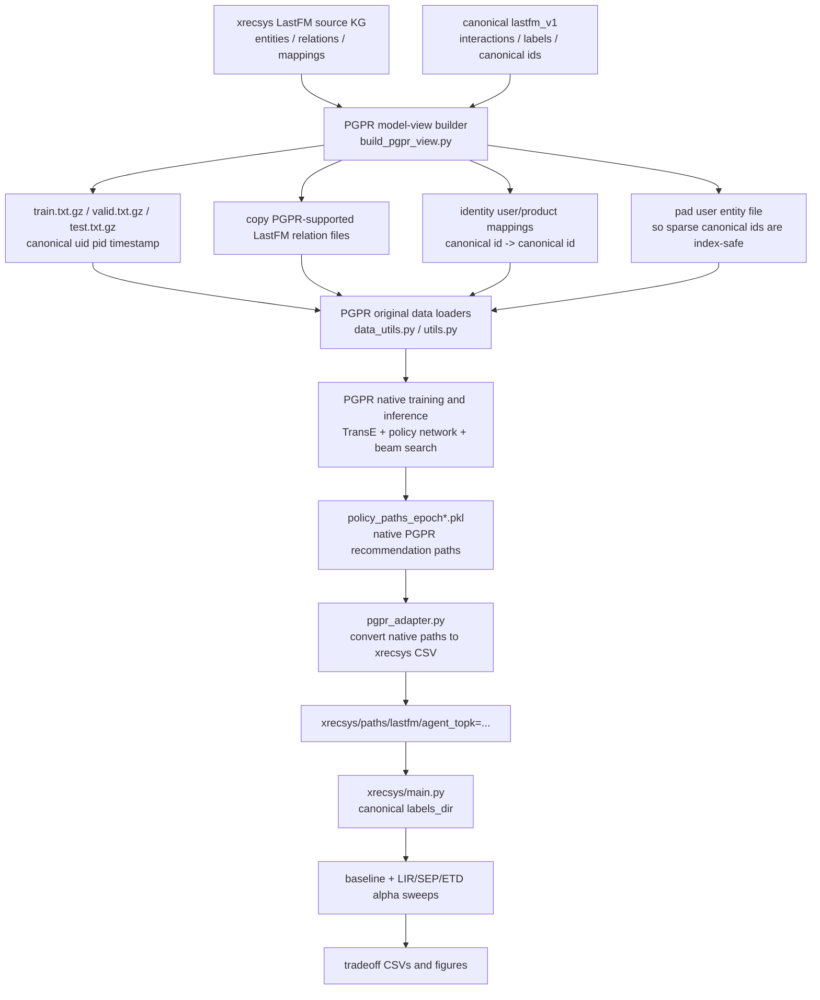

# PGPR Canonical Data Flow and Embedding Padding Bug

Date: 2026-06-12

This note answers two questions that came up during the canonical LastFM + PGPR debugging:

1. why the PGPR embedding table padding bug happened;
2. how data flows from the canonical dataset to PGPR, then back into `xrecsys`.

## Short Answer

For PGPR, relation matching is **not** done in `adapters/pgpr_adapter.py`.

Instead, we build a PGPR-compatible LastFM view before training:

```text
canonical lastfm_v1
+ source xrecsys LastFM KG assets
-> scripts/data/canonical/build_pgpr_view.py
-> PGPR-compatible train/test/relation/entity/mapping files
-> unmodified PGPR loaders and path search
```

The PGPR adapter only runs **after** PGPR has already generated native paths. It converts `policy_paths_epoch*.pkl` into the three CSV files required by `xrecsys`:

```text
pred_paths.csv
uid_topk.csv
uid_pid_explanation.csv
```

So the padding bug was **not** caused by relation-name matching inside the adapter. It was caused by using identity canonical ids inside PGPR while PGPR sized its embedding tables by entity-file line count.

## End-to-End Data Flow



## Where Relation Compatibility Is Handled

PGPR has a hard-coded LastFM schema. It does not accept an arbitrary KG schema without source-code changes.

The hard-coded relation/entity schema is visible in `xrecsys/models/PGPR/utils.py`:

```python
# xrecsys/models/PGPR/utils.py
LISTENED = 'listened'
MIXED_BY = 'mixed_by'
FEATURED_BY = 'featured_by'
SANG_BY = 'sang_by'
ALTERNATIVE_VERSION_OF = 'alternative_version_of'
ORIGINAL_VERSION_OF = "original_version_of"
RELATED_TO = 'related_to'
BELONG_TO = 'belong_to'
PRODUCED_BY_PRODUCER = 'produced_by_producer'

LASTFM_KG_RELATION = {
    USER: {LISTENED: SONG},
    SONG: {
        LISTENED: USER,
        PRODUCED_BY_PRODUCER: PRODUCER,
        SANG_BY: ARTIST,
        FEATURED_BY: ARTIST,
        MIXED_BY: ENGINEER,
        BELONG_TO: CATEGORY,
        RELATED_TO: RELATED_SONG,
        ORIGINAL_VERSION_OF: RELATED_SONG,
        ALTERNATIVE_VERSION_OF: RELATED_SONG,
    },
}
```

Therefore, the PGPR view builder only copies the LastFM relation files that PGPR already knows how to load:

```python
# scripts/data/canonical/build_pgpr_view.py
LASTFM_RELATIONS = [
    "alternative_version_of_s_rs.txt.gz",
    "belong_to_s_ca.txt.gz",
    "featured_by_s_a.txt.gz",
    "mixed_by_s_e.txt.gz",
    "orginal_version_of_s_rs.txt.gz",
    "produced_by_producer_s_pr.txt.gz",
    "related_to_s_rs.txt.gz",
    "sang_by_s_a.txt.gz",
]

copy_tree_files(source / "relations", out / "relations", names=LASTFM_RELATIONS)
```

This means:

- if a canonical KG relation is not supported by PGPR, it is not consumed by the PGPR view;
- this is a model-view projection, not an adapter-level repair;
- the comparison remains valid because outputs are mapped back to the same canonical user/item/label space.

## What The PGPR Adapter Does

The PGPR adapter is downstream of training and inference.

It reads native PGPR path output:

```python
# adapters/pgpr_adapter.py
with open(pkl_path, 'rb') as f:
    data = pickle.load(f)

paths = data['paths']
probs = data['probs']
```

It also loads PGPR's native TransE embedding export:

```python
# adapters/pgpr_adapter.py
user_embeddings = embeddings["user"]
product_embeddings = embeddings[product_type]
interaction_embedding = embeddings[interaction][0]

score = np.dot(
    user_embeddings[uid] + interaction_embedding,
    product_embeddings[pid],
)
```

This distinction is important:

```text
TransE score = native PGPR item relevance/ranking
RL action probabilities = native path search and explanation selection
```

The adapter then:

1. discards beam paths whose endpoint is not a `song`/`movie`;
2. filters products already present in the canonical training labels;
3. computes path probability as the product of the three policy action
   probabilities;
4. selects each item's explanation by path probability;
5. ranks items by the native TransE score;
6. min-max normalizes item scores to `[0, 1]` for xrecsys;
7. streams all candidate paths into the three standard CSV files.

There is no PGPR relation alias table in this adapter.

By contrast, UCPR does need adapter-level alias normalization because its exported names differ from `xrecsys` LastFM names:

```python
# adapters/ucpr_adapter.py
RELATION_ALIASES = {
    "belong_to_genre": "belong_to",
    "featured_by_artist": "featured_by",
    "mixed_by_engineer": "mixed_by",
}

ENTITY_ALIASES = {
    "product": "song",
    "genre": "category",
}
```

So the correct distinction is:

```text
PGPR: relation compatibility is handled before training by building a PGPR-compatible view.
UCPR: some relation/entity labels are normalized after path export by the adapter.
```

## Why The PGPR Padding Bug Happened

The canonical LastFM PGPR view intentionally uses identity mappings:

```python
# scripts/data/canonical/build_pgpr_view.py
with open(out_mappings_dir / "user_mappings.txt", "w", newline="") as f:
    writer = csv.writer(f, delimiter="\t")
    writer.writerow(["kgid", "canonical_uid"])
    for uid in users:
        writer.writerow([uid, uid])
```

This is useful because canonical ids can pass through PGPR unchanged. It also makes the output paths already use canonical `uid/pid`.

However, canonical user ids are sparse. The metadata shows:

```json
{
  "mapping_stats": {
    "users": 15552,
    "max_user_id": 23563
  },
  "entity_padding": {
    "user": {
      "original_count": 15773,
      "padded_count": 23564,
      "max_required_id": 23563,
      "padded": true
    }
  }
}
```

PGPR sizes entity vocabularies by counting lines in entity files:

```python
# xrecsys/models/PGPR/data_utils.py
vocab = self._load_file(entity_files[name])
setattr(self, name, edict(vocab=vocab, vocab_size=len(vocab)+1))
```

Those vocabulary sizes are then used to create embedding tables:

```python
# xrecsys/models/PGPR/transe_model.py
self.entities = edict(
    user=edict(vocab_size=dataset.user.vocab_size),
    song=edict(vocab_size=dataset.song.vocab_size),
    ...
)

embed = nn.Embedding(vocab_size + 1, self.embed_size, padding_idx=-1, sparse=False)
```

During PGPR environment rollout, the path's first node id is used directly as the user embedding index:

```python
# xrecsys/models/PGPR/kg_env.py
user_embed = self.embeds[USER][path[0][-1]]
```

Before padding, the original user entity file had only `15773` rows, while canonical user ids could be as high as `23563`. That means PGPR could try to read:

```text
self.embeds["user"][23563]
```

from an embedding table sized for roughly `15773` real users. This produced CUDA index errors:

```text
Assertion `srcIndex < srcSelectDimSize` failed
RuntimeError: CUDA error: CUBLAS_STATUS_NOT_INITIALIZED
```

The second error is a downstream CUDA failure after the invalid index corrupts the kernel state; the root cause is the out-of-range embedding index.

## The Fix

The fix is to pad the PGPR view's `entities/user.txt.gz` so that line count covers the largest canonical user id.

```python
# scripts/data/canonical/build_pgpr_view.py
def pad_entity_file_for_identity_ids(entity_dir, entity_name, max_id):
    ...
    while len(lines) <= max_id:
        lines.append(f"__canonical_pad_{entity_name}_{len(lines)}")
    write_plain_and_gzip_lines(path_no_gz, lines)
```

The builder applies it after writing identity mappings:

```python
# scripts/data/canonical/build_pgpr_view.py
mapping_stats = write_identity_mappings(canonical_root, out / "mappings", source / "mappings")
entity_padding = {
    "user": pad_entity_file_for_identity_ids(out / "entities", "user", mapping_stats["max_user_id"]),
}
```

This does **not** add real users, interactions, or paths. It only creates dummy entity rows so that sparse canonical ids are safe embedding indices.

The canonical labels still match exactly after rebuilding through PGPR's view:

```json
{
  "identity_label_validation": {
    "train": {
      "canonical_users": 15476,
      "rebuilt_users": 15476,
      "exact_match": true
    },
    "test": {
      "canonical_users": 14620,
      "rebuilt_users": 14620,
      "exact_match": true
    }
  }
}
```

## Why We Did Not Compact PGPR User IDs Instead

A compact remap would also fix the embedding-size issue:

```text
canonical_uid -> compact_pgpr_uid
```

But then every PGPR output path would need to be mapped back from compact ids to canonical ids. That is possible, but it adds another id-translation layer and increases the risk of silent mismatch.

For the first canonical LastFM PGPR run, identity mapping was chosen because it keeps the output contract simple:

```text
PGPR path uid/pid == canonical uid/pid
```

The cost is padding sparse entity files.

## What This Means For The Advisor's Data-Flow Question

The clean explanation is:

```text
We are not forcing arbitrary LastFM KG relations into PGPR through the adapter.

We first build a PGPR-compatible model view from the canonical dataset. This view keeps the canonical train/test labels and canonical user/item ids, but only exposes the relation/entity schema PGPR already supports.

PGPR then trains and generates native paths in its own mechanism. After that, the adapter only converts those native paths to xrecsys CSV format. xrecsys evaluates the resulting paths against canonical labels.
```

So the padding bug came from the id policy of the PGPR view:

```text
identity canonical ids + sparse ids + PGPR line-count-based embedding sizes
```

not from relation matching in the adapter.

## Current Caveats

- PGPR LastFM relation support is fixed by PGPR's source schema; unsupported canonical KG relations are excluded from the PGPR view.
- Padding is safe for indexing, but it should be documented because embedding table size no longer equals the number of real users.
- The historical tag `agent_topk=10-12-1-pgpr-canonical` was mislabeled: its 13.8 million paths show that the underlying beam was `25-50-1`. It remains a debug artifact.
- The corrected LastFM export is tagged `agent_topk=25-50-1-pgpr-canonical-native-score`.
- `ml1m_v1` uses identity user/movie ids; its current id ranges are contiguous enough that no PGPR padding rows are required.
