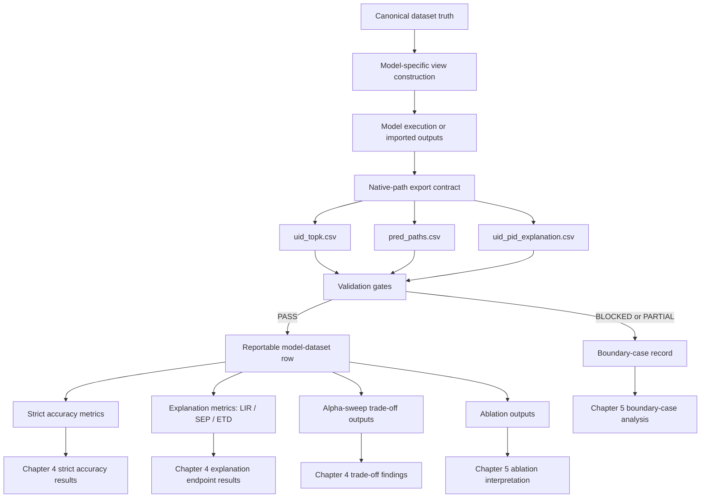
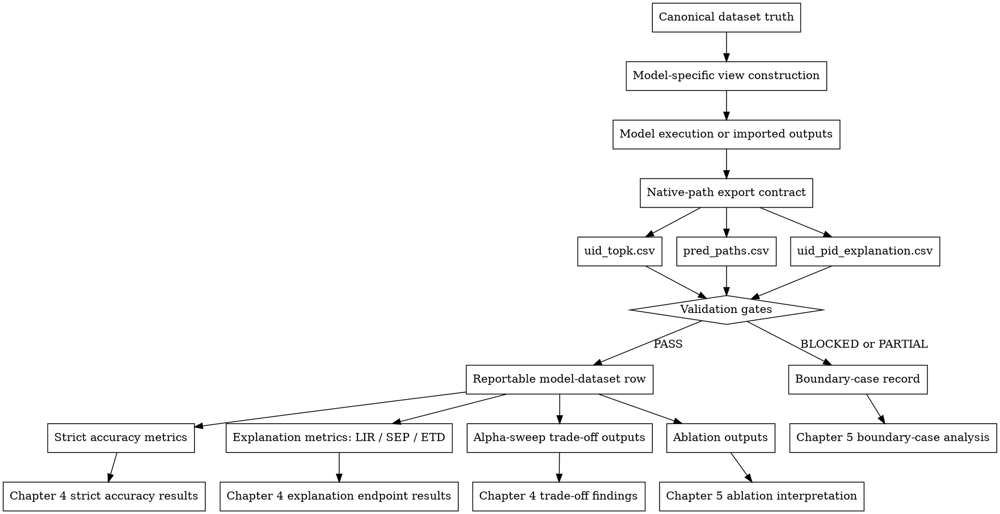
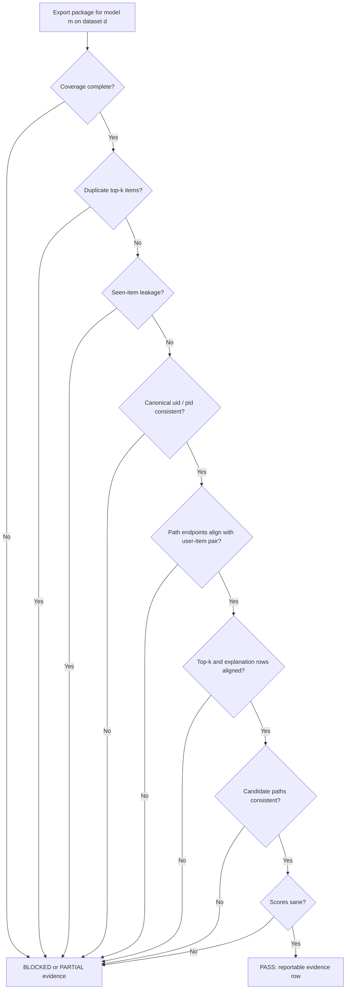
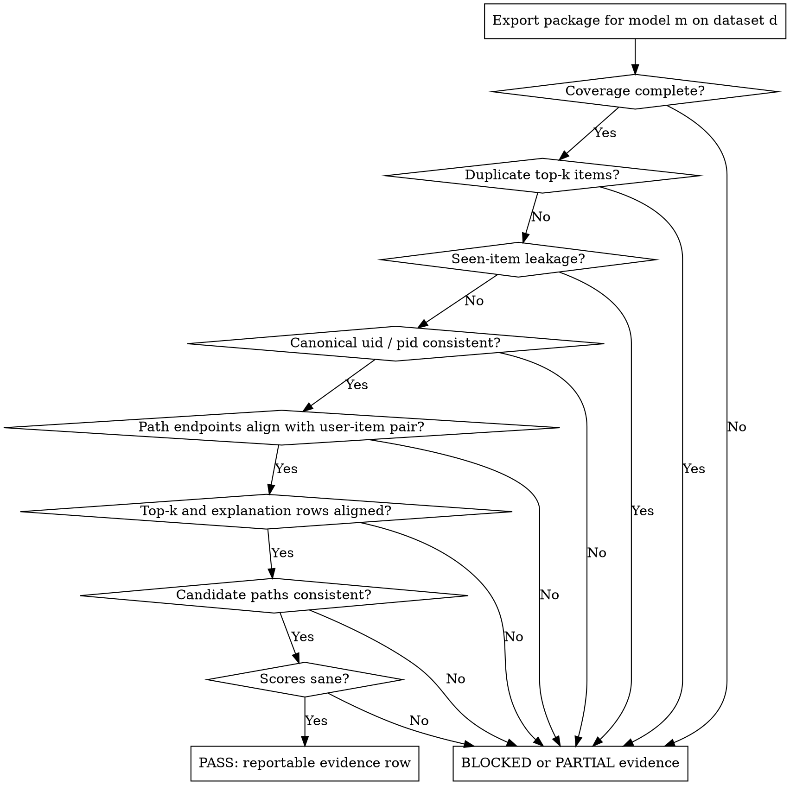
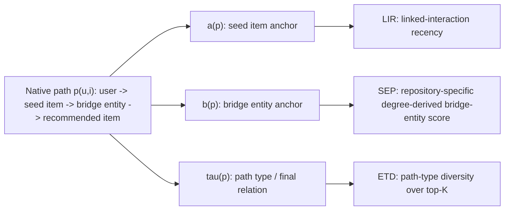
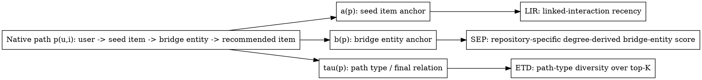

# Chapter 3 Dataflow and Validation Diagrams

## 1. End-to-End Framework Dataflow

### Purpose

Show how canonical dataset truth, model-specific execution, native-path exports, validation, and distinct reporting streams connect without presenting the framework as a new recommender architecture.

### Mermaid Specification

### Graphviz DOT Specification

### Proposed Caption

End-to-end canonical native-path evaluation dataflow. This diagram describes the evaluation framework dataflow and does not define a new recommender architecture. PASS rows enter distinct reporting streams, whereas BLOCKED or PARTIAL rows remain boundary evidence.

### Evidence Role

Conceptual map of the implemented evaluation contract. It contains no experimental values and does not establish model performance.

### Final Rendering Recommendation

Render from DOT to monochrome SVG after chapter wording and placement are frozen.

### Placement Recommendation

Chapter 3.1, main text.

## 2. Validation Gate Flowchart

### Purpose

Make reportability eligibility explicit and distinguish validation failure from recommendation performance.

### Mermaid Specification

### Graphviz DOT Specification

### Proposed Caption

Validation gate for a model-dataset export package. This flowchart shows validation eligibility, not recommendation performance. BLOCKED or PARTIAL status must not be interpreted as a low-performing model result.

### Evidence Role

Conceptual summary of the registered checks used to determine whether a row is reportable.

### Final Rendering Recommendation

Render from DOT to monochrome SVG, with decision nodes visually distinct from terminal statuses.

### Placement Recommendation

Chapter 3.4, main text.

## 3. Metric Anchor Schematic

### Purpose

Show which native-path component anchors LIR, SEP, and ETD while retaining the repository-specific boundary of each definition.

### Mermaid Specification

### Graphviz DOT Specification

### Proposed Caption

Metric anchors in the registered native-path structure. LIR uses the seed-item interaction anchor, SEP uses a repository-specific degree-derived bridge-entity score, and ETD uses the path-type taxonomy over the top-K explanations. These computational properties do not establish user-perceived explanation quality.

### Evidence Role

Definition aid based on `docs/guides/PATH_METRICS_GUIDE.md`, `xrecsys/metrics.py`, and related repository code. Historical SEP matrix-cache provenance still requires manual verification.

### Final Rendering Recommendation

Render from DOT or recreate in draw.io as a monochrome vector schematic after SEP wording is frozen.

### Placement Recommendation

Chapter 3.4, main text if space permits; otherwise appendix with an in-text reference.
