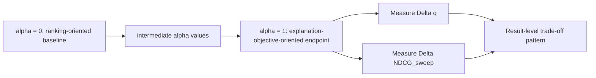
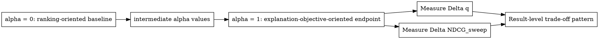
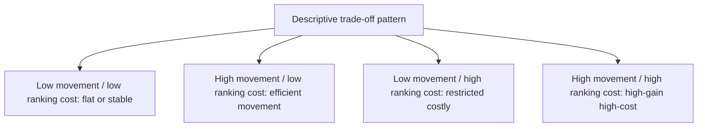
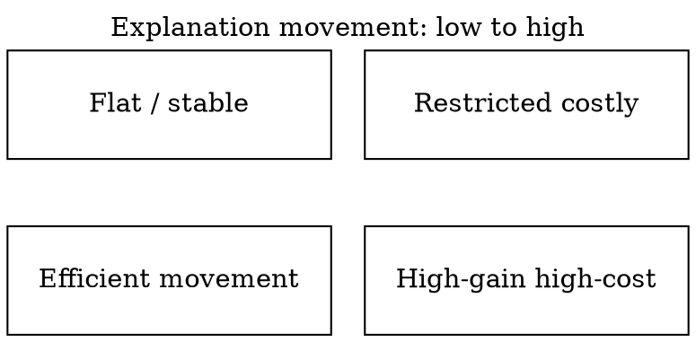
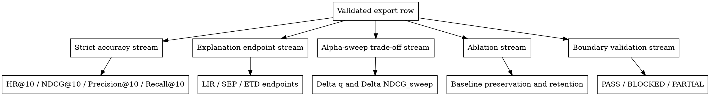

# Chapter 4 Trade-off Pattern Diagrams

## 1. Alpha-Sweep Trade-off Process

### Purpose

Show how the registered objective-specific sweep is summarised by explanation movement and paired sweep NDCG movement, without defining a universal alpha formula.

### Mermaid Specification



### Graphviz DOT Specification



### Proposed Caption

Objective-specific alpha-sweep reporting process. The sweep NDCG in this diagram is paired alpha-sweep evidence and must not be interpreted as strict NDCG@10. LIR, SEP, and ETD retain their implementation-specific controls; the diagram does not impose one universal linear score.

### Evidence Role

Conceptual reporting aid for the registered sweep endpoints and trajectories. It adds no result and no inferential statistic.

### Final Rendering Recommendation

Render from DOT to monochrome SVG after the Chapter 4 placement is frozen.

### Placement Recommendation

Chapter 4.1, main text. A shorter cross-reference may also appear in Chapter 3.6.

## 2. Empirical Trade-off Pattern Schematic

### Purpose

Provide a vocabulary for grouping the descriptive response patterns discussed in Chapter 4 without creating a metric, threshold, or model ranking.

### Markdown Matrix

| Ranking cost / explanation movement | Low movement | High movement |
| --- | --- | --- |
| Low ranking cost | Flat / stable | Efficient movement |
| High ranking cost | Restricted costly | High-gain high-cost |

### Mermaid Specification



### Graphviz DOT Specification



### Proposed Caption

Schematic vocabulary for the descriptive Chapter 4 trade-off patterns. This schematic summarises empirical pattern types. It is not a new metric and does not assign statistical significance. Placement in a cell does not establish model superiority or causal mechanism.

### Evidence Role

Result-level synthesis aid for patterns already reported in the registered strict and alpha-sweep evidence streams.

### Final Rendering Recommendation

Retain the Markdown matrix if a compact table is clearer. If rendered, recreate as a simple monochrome quadrant in DOT or draw.io without plotting experimental points.

### Placement Recommendation

Chapter 4.7, main text; keep as a table rather than a numbered figure if the supervisor prefers fewer conceptual figures.

## 3. Evidence-Stream Separation

### Purpose

Make the role and boundary of each evidence stream explicit so that strict accuracy is not replaced by sweep or ablation values.

### Mermaid Specification

```mermaid
flowchart TD
    A[Validated export row] --> B[Strict accuracy stream]
    A --> C[Explanation endpoint stream]
    A --> D[Alpha-sweep trade-off stream]
    A --> E[Ablation stream]
    A --> F[Boundary validation stream]
    B --> B1[HR@10 / NDCG@10 / Precision@10 / Recall@10]
    C --> C1[LIR / SEP / ETD endpoints]
    D --> D1[Delta q and Delta NDCG_sweep]
    E --> E1[Baseline preservation and retention]
    F --> F1[PASS / BLOCKED / PARTIAL]
```

### Graphviz DOT Specification



### Proposed Caption

Separation of the five registered evidence streams. The streams are intentionally separated to avoid replacing strict accuracy with sweep evidence or ablation evidence. Boundary statuses record reportability and are not comparative performance values.

### Evidence Role

Conceptual evidence-provenance map; no values or new experimental conclusions are introduced.

### Final Rendering Recommendation

Render from DOT to monochrome SVG with equal visual weight for the five streams.

### Placement Recommendation

Chapter 3.6, main text. Chapter 4 may cite it rather than repeat it.
