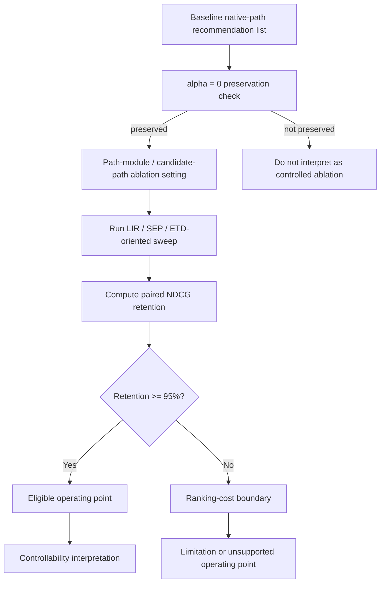
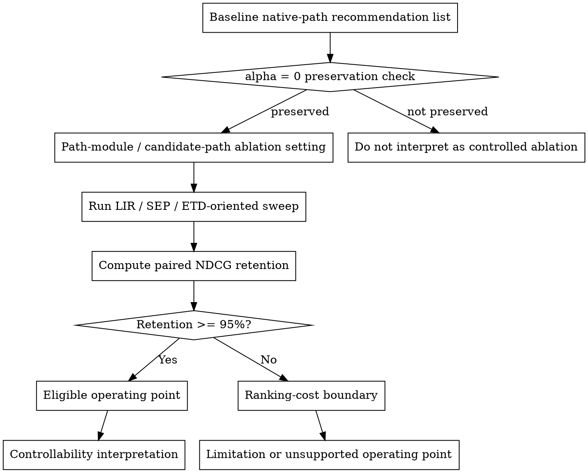
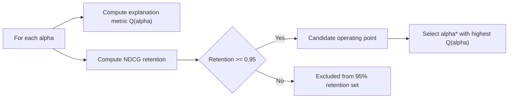
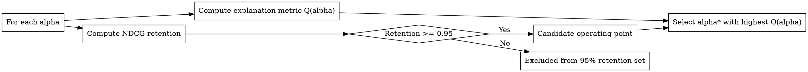
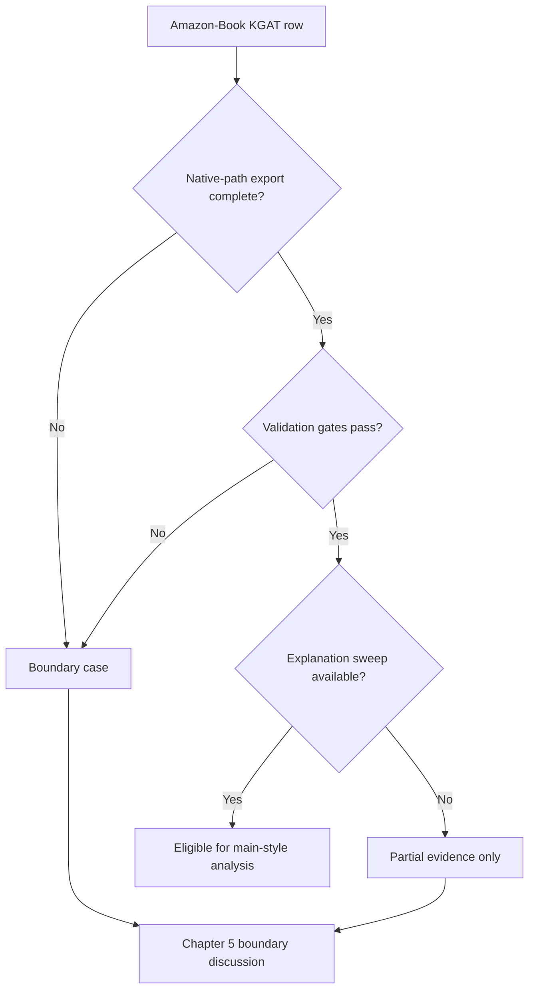
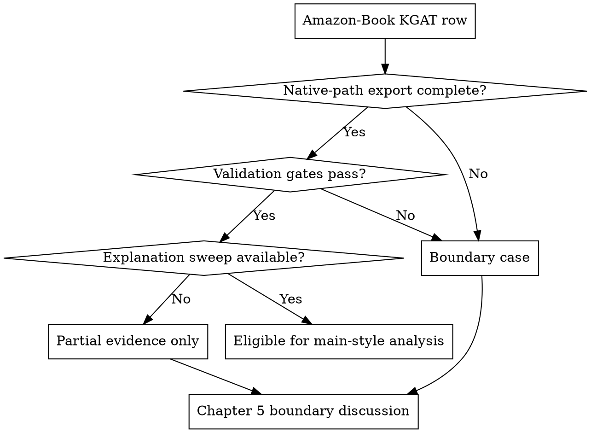

# Chapter 5 Ablation and Boundary Diagrams

## 1. PGPR/UCPR Ablation Evidence Flow

### Purpose

Show the registered sequence from alpha-zero preservation through objective-specific ablation sweeps to a bounded controllability interpretation.

### Mermaid Specification

### Graphviz DOT Specification

### Proposed Caption

Registered PGPR/UCPR ablation evidence flow. This diagram describes the PGPR/UCPR ablation evidence stream. It does not establish six-model superiority. The interpretation is limited to the frozen-item-set, baseline-preserving protocol.

### Evidence Role

Protocol summary for the existing registered ablation artifacts; it adds no model result or causal claim.

### Final Rendering Recommendation

Render from DOT to monochrome SVG after the Chapter 5 wording is frozen.

### Placement Recommendation

Chapter 5.1, main text before the detailed formula and operating-point discussion.

## 2. 95% NDCG Retention Operating Point

### Purpose

Show how candidate alpha values enter the ablation-only retention set and how the objective-specific operating point is selected.

### Mermaid Specification

### Graphviz DOT Specification

### Proposed Caption

Selection of an objective-specific operating point under the registered ablation constraint. The 95% threshold is used only within the ablation evidence stream and is not a general model-ranking criterion.

### Evidence Role

Visual restatement of the existing constrained operating-point rule. It does not add a threshold to strict accuracy or the Chapter 4 sweeps.

### Final Rendering Recommendation

Render from DOT to monochrome SVG; retain as an appendix candidate if the formula is sufficient in the main text.

### Placement Recommendation

Chapter 5.1 after the retention and constrained-selection formulas, or appendix with an in-text reference.

## 3. Amazon Boundary-Case Decision Flow

### Purpose

Show how native-path export completeness, validation, and explanation-sweep availability determine Amazon reportability without ranking blocked rows.

### Mermaid Specification

### Graphviz DOT Specification

### Proposed Caption

Decision flow for the partial Amazon-Book KGAT boundary case. This diagram records reportability and boundary status, not comparative recommendation performance. Current validated rows remain partial evidence because the complete explanation-sweep protocol is unavailable.

### Evidence Role

Boundary and reportability summary of existing validation status. PASS does not imply a complete six-model Amazon comparison, and BLOCKED / N/A does not imply poor model performance.

### Final Rendering Recommendation

Render from DOT to monochrome SVG only if the decision flow adds clarity beyond the existing status matrix.

### Placement Recommendation

Chapter 5.4 after the eligibility and boundary-set definitions, or appendix with an in-text reference.
