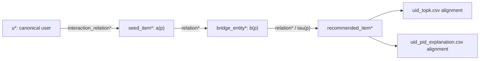
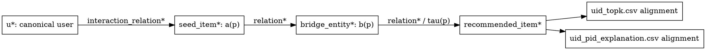

# Single Example Trace

## 1. Source Artifact

- Dataset: not assigned; schematic only
- Model: not assigned; schematic only
- Source file: no safe validated example export was found in the accessible worktree
- Row identifier: not applicable
- Whether values are anonymised: abstract placeholders are used rather than source values
- Example type: schematic

This is an illustrative schematic example, not an experimental result.

## 2. Canonical Recommendation

| Field | Value |
| --- | --- |
| canonical uid | `u*` |
| recommended pid | `recommended_item*` |
| top-k position | `j*` |
| recommendation export role | `uid_topk.csv` row placeholder |

## 3. Native Path

| Path position | Relation | Entity type | Entity id |
| --- | --- | --- | --- |
| Start | `relation*` | user | `u*` |
| Seed anchor | `interaction_relation*` | item | `seed_item*` |
| Bridge anchor | `relation*` | bridge entity | `bridge_entity*` |
| End | `relation*` | item | `recommended_item*` |

### Mermaid Specification

### Graphviz DOT Specification

## 4. Validation Interpretation

| Gate | Result | Explanation |
| --- | --- | --- |
| Coverage | schematic only | A real row would need to belong to the declared evaluation population. |
| Canonical identifier consistency | schematic only | `u*` and `recommended_item*` indicate the canonical endpoints that would be checked. |
| Path endpoint alignment | schematic only | The path starts at `u*` and ends at `recommended_item*`. |
| Top-k and explanation alignment | schematic only | A real recommendation and explanation row would need the same canonical user-item pair. |
| Candidate-path consistency | schematic only | A real path would need source-backed relations, entity types, and candidate evidence. |
| Reportability | not assessed | No PASS, BLOCKED, or PARTIAL status is assigned to this schematic. |

## 5. Metric Interpretation

| Metric component | How this example contributes |
| --- | --- |
| LIR | `seed_item*` represents `a(p)`, whose linked interaction supplies the repository-specific recency anchor. |
| SEP | `bridge_entity*` represents `b(p)`, which indexes the repository-specific degree-derived bridge-entity score. |
| ETD | `relation*` at the final transition represents `tau(p)` within the declared path-type taxonomy. |
| Strict accuracy | The schematic contributes no value; a real `recommended_item*` would be checked against canonical labels. |
| Alpha sweep | The schematic contributes no value and does not define an objective-specific score function. |

## 6. Proposed Caption

Schematic alignment of one canonical user-item recommendation with its native path and metric anchors. The single example illustrates artifact alignment and metric anchors; it is not a standalone experimental result.

## 7. Evidence Boundary

This single example illustrates dataflow only. It is not used as a standalone performance result.

No user ID, item ID, relation, path, score, metric value, model, dataset, checkpoint, seed, or hyperparameter is asserted. A real source-traced replacement requires a validated `uid_topk.csv`, `pred_paths.csv`, and `uid_pid_explanation.csv` row from the same registered export package.

## 8. Rendering and Placement Recommendation

Keep the tables as the authoritative draft source and use the Mermaid or DOT trace only as a layout aid. Place the concise trace in Chapter 3.3; move the full validation interpretation table to an appendix if main-text space is constrained.
